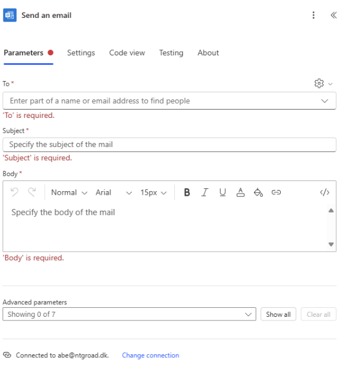
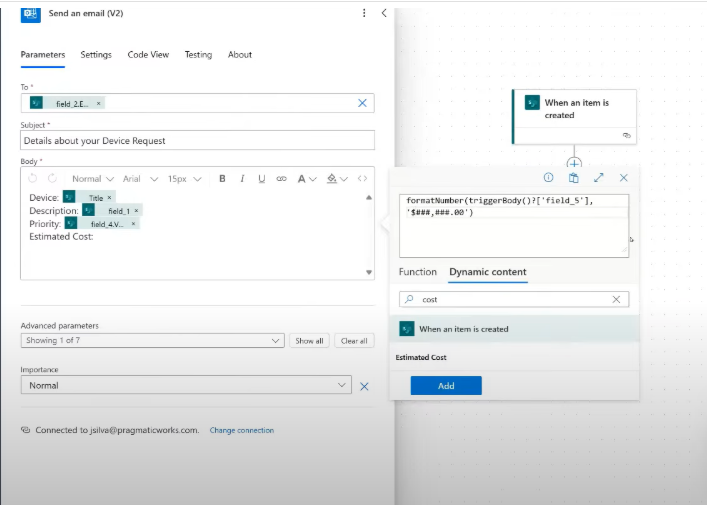
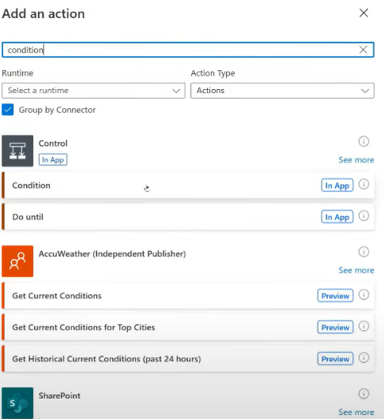
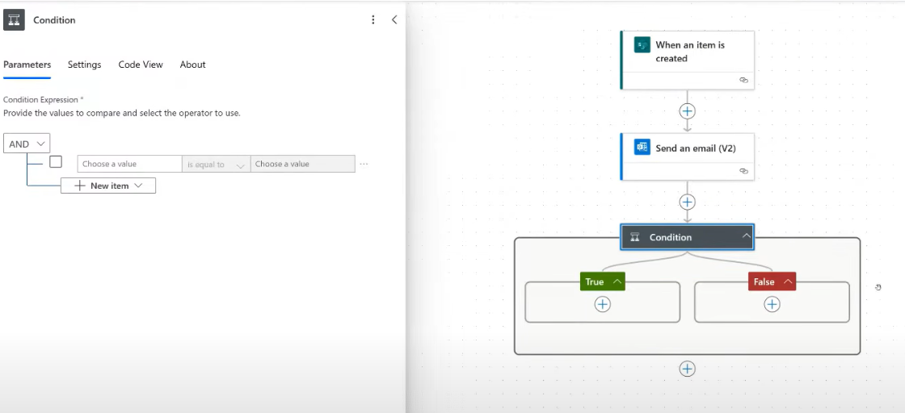
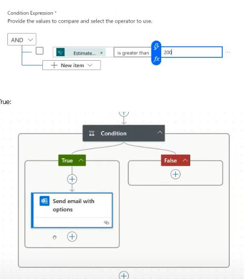
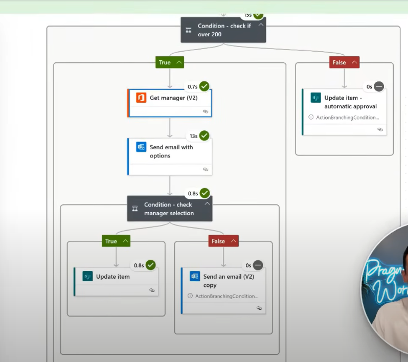

# ⚡ Power Automate

## 🔄 Как процесът се активизира:

### 📌 Схема 1: Стартиране на Flow

```
+----------+         +-----------------+
| Triggers | ----->  | Start the Flow  |
+----------+         +-----------------+
```

---

### 🧱 Схема 2: Видове "Create Flow"

```
                                         +--------+
                                         | Create |
                                         +--------+
                                             |
               +-----------------------------+------------------------------+
               |                             |                              |
               v                             v                              v
 +----------------------------+ +----------------------------+ +----------------------------+
 | Instant Cloud Flow         | | Automated Cloud Flow       | | Scheduled Cloud Flow       |
 | (С ръчно активизиране)     | | (На база дадено събитие)   | | (По график)                |
 +----------------------------+ +----------------------------+ +----------------------------+

```

## 💡 Начини, които да ползваме за лесно създаване на Flow

Преди да започнем, е важно да си отговорим на въпроса:

➡️ **Какви действия са ни нужни?**

След това можем да използваме следните подходи:

1. ✅ **Flow Templates** – Лесен начин чрез готови темплейти, които можем директно да адаптираме.
2. 🤖 **Describe It to Design It** – Използване на prompt към вградения **Copilot**, който автоматично генерира Flow спрямо описание на процеса.

---

## 🧱 Building Blocks of Cloud Flows

### 📌 Схема на основните елементи

```
+----------+          +-------------+          +-----------+          +------------+          +--------------+
| Trigger  |   --->   | Action      |   --->   | Loop      |   --->   | Condition  |   --->   | True / False |
+----------+          +-------------+          +-----------+          +------------+          +--------------+

 (Примерни блокове)
   Trigger     →  Get Items (Action)  →  For Each (Loop)  →  Condition (Logic)  →  True or False
```

## 📝 Въвеждане в създаването на Flow

Процесът на създаване минава през следните основни стъпки:

1. 📂 **Избор на нужния темплейт** – от готовите шаблони в Power Automate.
2. 📥 **(Задължително)** Добавяне на `Get response details` – за извличане на информация от формуляри или други входни данни.
3. 💾 **Save** – Запазване на Flow-а.
4. 🧪 **Test** – Изпълнение на Flow-а с примерни данни.
5. ✏️ **Edit** – Нанасяне на корекции при нужда.

---

### 📌 Схема на процеса по въвеждане

```
+----------------------+ 
| Избор на темплейт    |
+----------+-----------+
           |
           v
+--------------------------+
| Get response details     |
| (ЗАДЪЛЖИТЕЛНО)           |
+----------+---------------+
           |
           v
+----------+     +---------+     +--------+
|  Save    | --> |  Test   | --> |  Edit  |
+----------+     +---------+     +--------+
```
## Пращане на мейл** 




## Formatting Date 





## Conditions







